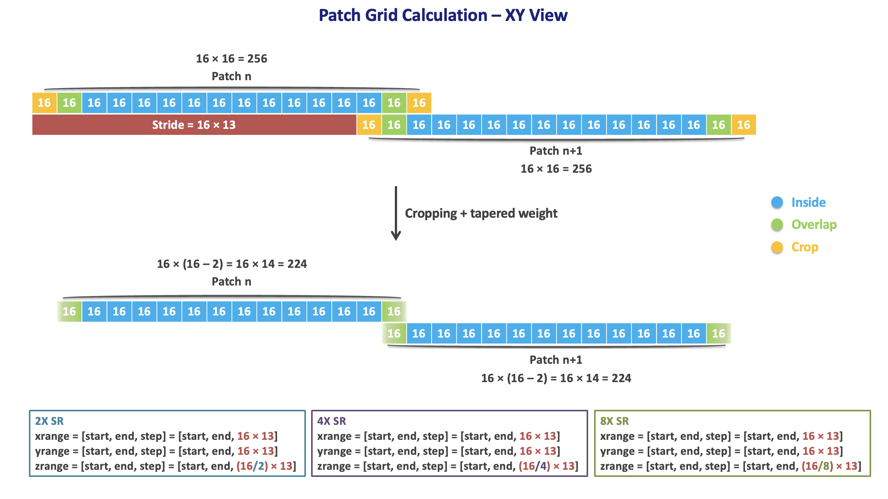

# TestingMicroscopyXX

A deep learning framework for 3D microscopy image super-resolution and reconstruction.

## Overview

This project performs inference and reconstruction on 3D microscopy images using various neural network architectures including Autoencoders, GANs, and Vector Quantized models. It supports patch-based processing for large volumetric data with seamless assembly.

## Features

- **Multiple Model Architectures**: Autoencoders (AE), GANs, VQ-VAE2, CycleGAN/CUT
- **3D Volume Processing**: Patch-based inference with overlapping regions
- **Test-Time Augmentation**: Multiple augmentation strategies for robust predictions
- **Monte Carlo Inference**: Uncertainty estimation via multiple inference runs
- **FP16 Precision**: Efficient mixed-precision inference
- **Seamless Assembly**: Tapered weighting for smooth patch stitching

## Supported Microscopy Modalities

- Structured Illumination Microscopy (SIM)
- Selective Plane Illumination Microscopy (SPIM)
- Golgi apparatus imaging
- Expansion microscopy (iUExM)
- Blood vessel imaging
- Organoid imaging

## Project Structure

```
TestingMicroscopyXX/
├── test.py                # Main inference script
├── run.sh                 # Execution examples
├── requirements.txt       # Dependencies
├── models/                # Model definitions
│   ├── base.py            # Base classes, VGG losses
│   ├── ae0iso0tc.py       # AutoEncoder model
│   └── CUT.py             # Contrastive Unpaired Translation
├── networks/              # Neural network architectures
├── utils/                 # Utility modules
├── ldm/                   # Latent Diffusion Model components
├── taming/                # VQGAN/taming modules
└── test/                  # YAML configuration files
```

## Installation

```bash
pip install -r requirements.txt
```

### Key Dependencies

- PyTorch 1.10.0
- PyTorch Lightning 1.9.5
- tifffile, OpenCV, scikit-image
- albumentations, einops

## Usage

Run inference and assembly in one step:

```bash
# Output as TIFF (default)
python test.py --gpu --config filopodiaX4 --option ENC
# Output as Zarr
python test.py --gpu --config filopodiaX4 --option ENC --output_format zarr
# Only want to output xy tiff
python test.py --gpu --config filopodiaX4 --option ENC --save xy
```

**Arguments:**

| Argument | Description | Default |
|----------|-------------|---------|
| `--config` | Config file name in `test/` (without `.yaml`) | required |
| `--option` | Model section in config (e.g. `ENC`) | required |
| `--gpu` | Use GPU acceleration | off |
| `--fp16` | Use FP16 mixed-precision inference | off |
| `--augmentation` | Augmentation stage: `encode` or `decode` | `encode` |
| `--save` | Targets to save: `ori` (upsampled input), `xy` (enhanced result) | `ori xy` |
| `--output_format` | `tiff` (per-slice) or `zarr` (5D volume) | `tiff` |
| `--output_datatype` | `float32`, `uint8`, or `uint16` | `float32` |

## Configuration

YAML config files in `test/` have two sections: `DEFAULT` (shared parameters) and a model section (e.g. `ENC`):

```yaml
DEFAULT:
  SOURCE: '/path/to/models/'              # {SOURCE}/logs/{prj} = full model checkpoint path
  root_path: '/path/to/input/data/'       # {root_path}/{image_path[0]} = full input image path
  DESTINATION: '/path/to/output/'         # {DESTINATION}/{dataset} = full output path
  upsample_params:                        # trilinear upsample target size
    size: [32, 256, 256]                  # same with dx_shape if no upsample
  assemble_params:
    C: [16, 16, 16]                       # crop margin per side (pixels)
    S: [16, 16, 16]                       # overlap for tapered blending
    dx_shape: [32, 256, 256]              # inference patch size (Z, Y, X)
    # 8X SR -> dx_shape = [256/8, 256, 256] = [32, 256, 256]
    # 4X SR -> dx_shape = [256/4, 256, 256] = [64, 256, 256]
    # 2X SR -> dx_shape = [256/2, 256, 256] = [128, 256, 256]
    weight_shape: [224, 224, 224]         # dx_shape - C * 2
    weight_method: "cross"                # currently only one method available, no need to change 
    testwhole: True                       # process entire volume
    # If testwhole = False, the default ROI size for testing is (256, 1024, 1024)
    zrange: [0, 256 - 13 * 2, 13 * 2]     # [start, end, step]
    xrange: [0, 1024 - 13 * 16, 13 * 16]
    yrange: [0, 1024 - 13 * 16, 13 * 16]
    # If testwhole = True, only the step value matters (start and end are auto-calculated from image size)
    # 8X SR -> zrange = [0, 256 - 13 * 16/8, 13 * 16/8]
    #          yrange = [0, 1024 - 13 * 16, 13 * 16]
    #          xrange = [0, 1024 - 13 * 16, 13 * 16]
    # 4X SR -> zrange = [0, 256 - 13 * 16/4, 13 * 16/4]
    #          yrange = [0, 1024 - 13 * 16, 13 * 16]
    #          xrange = [0, 1024 - 13 * 16, 13 * 16]
    # 2X SR -> zrange = [0, 256 - 13 * 16/2, 13 * 16/2]
    #          yrange = [0, 1024 - 13 * 16, 13 * 16]
    #          xrange = [0, 1024 - 13 * 16, 13 * 16]
  mc: 1                                   # Monte Carlo passes
  input_augmentation: [null, 'transpose'] # test-time augmentations
  output_channel: 1                       # number of output channels in the assembled volume
  z_scale_ratio: 8                        # Z-axis scale factor
  # 8X SR -> z_scale_ratio = 8
  # 4X SR -> z_scale_ratio = 4
  # 2X SR -> z_scale_ratio = 2

ENC:
  dataset: "filopodia"                    # {DESTINATION}/{dataset} = full output path
  image_list_path: null                   # not currently used, no need to change
  image_path: ["input.tif"]               # {root_path}/{image_path[0]} = full input image path
  prj: "project/experiment/"              # {SOURCE}/logs/{prj} = full model checkpoint path
  epoch: 500                              # checkpoint epoch
  model_type: "VQQ2"                      # AE / GAN / VQQ2
  hbranchz: true                          # use encoder posterior as h-branch input (VQQ2 only)
  downbranch: 1                           # 1 for 8X SR, 2 for 4X SR, 4 for 2X SR
  checking_codebook: true                 # log VQ codebook usage during inference (VQQ2 only)
  decode_augmentation: false              # apply additional augmentations during decoding
  norm_method: ["11"]                     # '00'=as-is, '01'=0-1, '11'=-1~1
  trd: [[ None, None]]                    # intensity clipping thresholds [lower, upper] before normalization. [None, None] = no clipping
  norm_mean_std: null                     # not currently used
  norm_percentile: [0.1, 99.9]            # percentile clipping range applied after normalization
```

## Workflow

1. **Configure**: Create or select a YAML config file in `test/`
2. **Run Inference**: Execute `run.sh` to inference and assembly in one step
3. **Output**: Reconstructed 3D volumes (TIFF or Zarr)
    - Supports uint8, uint16, float32 formats
    - Save targets: `ori` (upsampled input), `xy`(model-enhanced result)
    - Output formats: TIFF (per-slice) or Zarr (5D volume)
    - Default viewing plane is YZ (TIFF saves one YZ slice per X position; Zarr stores X as the primary axis for the same view)
    
### Patch Grid Calculation

The model takes input patches of size `(Z, Y, X) = (256/z_scale_ratio, 256, 256)` and outputs `(256, 256, 256)`. To avoid boundary artifacts, each output patch is cropped by `C` pixels on each side before assembly, resulting in a `(224, 224, 224)` cube. Each cropped patch is then multiplied by a tapered weight that decays toward the edges. Adjacent patches overlap by `S` pixels and are summed in the overlap region for seamless blending. 

The figure below illustrates how the crop size `C` and overlap `S` determine the step size:



**Note:** The step size of `zrange` depends on the Z upscaling factor. If the Z dimension is upscaled by `k×`, the `zrange` step size becomes `1/k` times the `xrange` and `yrange` step size.

## Viewing Zarr Output

To view Zarr results in a web viewer (e.g. [Avivator](https://avivator.gehlenborglab.org/)), start a local HTTP server from the Zarr root directory:

```bash
# If the Zarr path is result/xxx.zarr:
cd result
npx http-server -p 8001 --cors='*'
```

Then open the Zarr data in Avivator using the URL: `http://localhost:8001/xxx.zarr`

