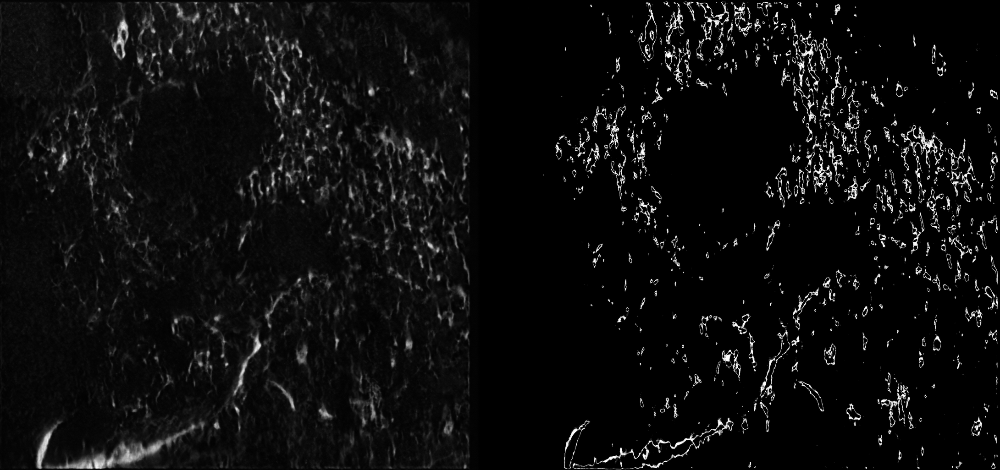

# Monte Carlo Uncertainty Estimation

Monte Carlo (MC) inference runs the model multiple times with stochastic sampling to estimate prediction uncertainty. In this repository, it is used to generate boundary maps of cellular structures. The following sections explain how to configure and run this process.

## How it works

Setting `num_mc > 1` repeats each entry in `tta_method`, resulting in:

total passes = `len(tta_method)` × `num_mc`

For example:
- `num_mc`: 3
- `tta_method`: [null, "transpose"] 

This results in 6 forward passes, where each TTA setting is repeated 3 times.

The boundary map (`xystd`) is computed as the standard deviation across all passes after converting each output into a binary map using `mc_threshold`.Regions with high std indicate inconsistent predictions across runs, corresponding to uncertain boundaries.

## Step 1: Determine `mc_threshold`

1. Run normal inference to get the `xy` output:

    ```bash
    python test.py --env GHCL00 --scale 8x --override MyExperiment
    ```

2. Make sure the `xy` values are in the range `[-1, 1]`. If not, normalize them before selecting the threshold.

3. Adjust a threshold to separate structure from background.

**Note**: The threshold is applied to the model output before it is converted to the final normalized format. So when choosing `mc_threshold`, use values in the `[-1, 1]` range. Steps 2–3 can be done in ImageJ.

## Step 2: Run MC inference with xystd output

1. Configure the experiment yaml:
    ```yaml
    # In experiment config (e.g. cfg/MyExperiment.yaml)
    model:
      num_mc: 5                  # Number of MC passes, adjust as needed
      mc_threshold: -0.6         # Adjust based on Step 1
    output:
      save: ["xystd"]
    ```
2. run MC inference
    ```bash
    python test.py --env GHCL00 --scale 8x --override MyExperiment
    ```
## Result
- The `xystd` output is saved as uint8

- The following figure shows an example result. Left side is `xy`(model-enhanced output), and right side is `xystd` (MC boundary map).

